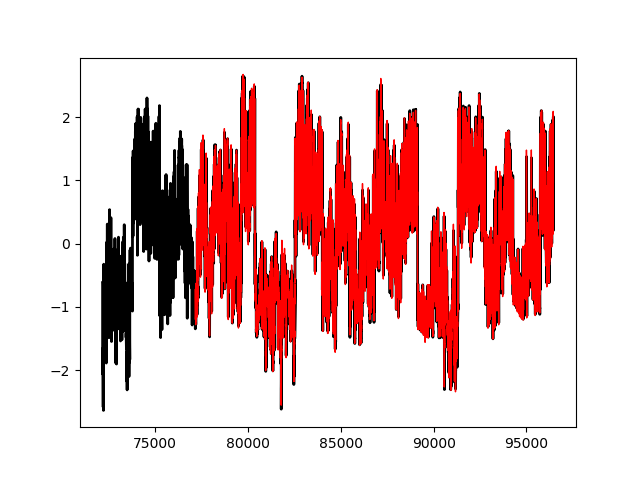
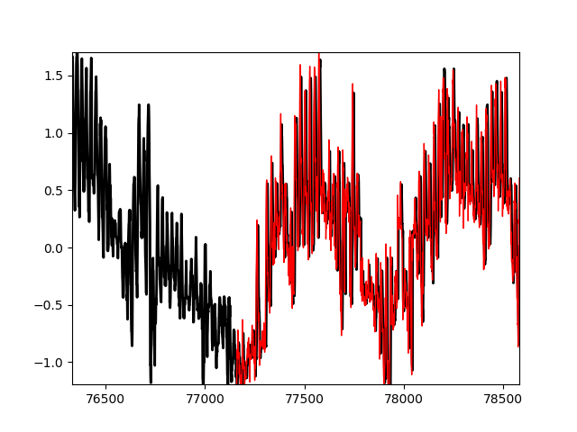

# Random-Forest-Regressor-for-time-series-prediction
Basic times series regression using the Random Forest Regression algorithm

Just a test on the classic weather prediction project but without using Deep Learning and instead the powerful Random Forest algorithm. The results were outstanding and I will be using this one more frequently.

The images show the predicted weather data (red color) and what really happened (black). Looks promising.

